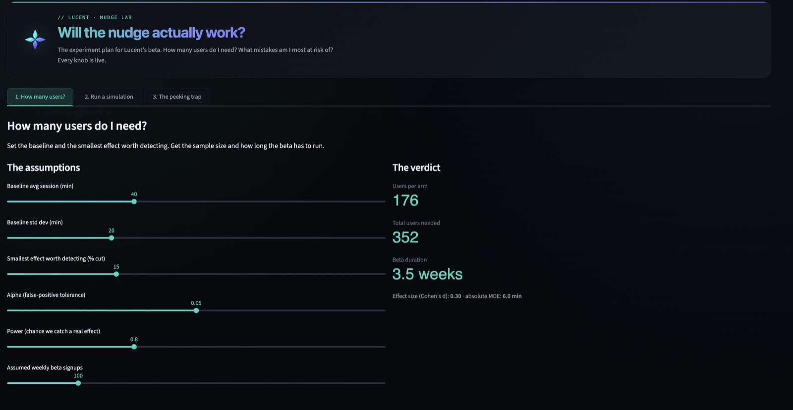

# Wissam Ezzedine

**MSc Business Analytics & Data Science @ IE University**, Madrid · Data Analyst with ML depth

I turn messy, multi-table data into decisions and ship things end to end, from SQL and Python to live dashboards and deployed apps, not just notebooks. BCom in Business Technology Management (Concordia), three internships behind me, and Lucent, an AI screen-time coaching app, in build.

---

## Tools & Skills

**Languages**

**Tools & Libraries**

- **Core:** Python (pandas, NumPy, scikit-learn, LightGBM) · SQL (CTEs, window functions, DuckDB) · Tableau · Power BI · Excel
- **Analysis:** EDA · statistical testing (hypothesis & A/B) · classification & predictive modeling · data visualization
- **Building & AI:** Streamlit · REST API extraction · LLMs & AI agents · Swift/iOS · Git · Jupyter

---

## GitHub Stats

---

## Featured Projects

- **[Lucent Nudge Experiment](https://github.com/Wiss-21/lucent-nudge-experiment):** Streamlit power-analysis tool pre-registering the beta experiment for Lucent, an AI screen-time coaching app I'm building. [Live app](https://lucent-nudge-wissam-ezzedine.streamlit.app/).
- **[Europe's Top 5 Leagues](https://github.com/Wiss-21/top5-leagues-dashboard):** interactive Tableau dashboard on data I pulled myself from the Football-Data.org REST API. [Live dashboard](https://public.tableau.com/views/EuropesTop5Leagues202324/Rankings).
- **[Olist Review Risk](https://github.com/Wiss-21/olist-review-dashboard):** end-to-end Streamlit app on 94k orders with a LightGBM review-risk model. [Live app](https://olist-review-wissam.streamlit.app).
- **[Madrid Airbnb](https://github.com/Wiss-21/madrid-airbnb-sql):** SQL deep-dive on 23k listings + 8.4M calendar rows in DuckDB (CTEs, window functions).
- **[Cars 2025](https://github.com/Wiss-21/cars-2025-analysis):** EDA on 1,218 2025-model vehicles: electrification mix, performance baselines, and outlier analysis across manufacturers.

---

## Interests

Data Analytics · Business Intelligence · Applied Machine Learning · Football Analytics · Behavior-change products

## Connect

